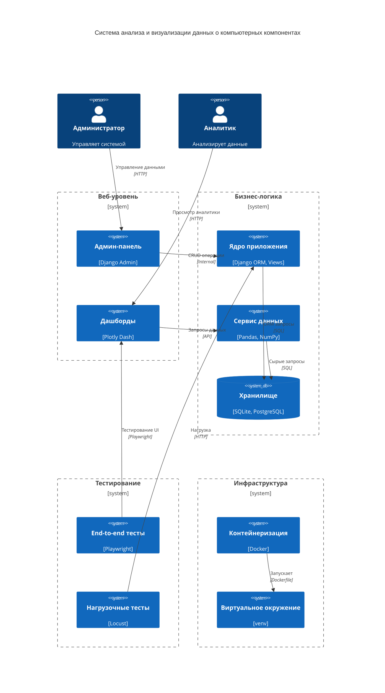

---

# Запуск проекта

## 1. Запуск контейнеров

```sh
cd /workspaces/codespaces-blank/project_practice
docker-compose up
```

## 2. Настройка окружения для Playwright

```sh
cd /workspaces/codespaces-blank/project_practice/playwright/
python -m venv venv 
source venv/bin/activate
pip install -r requirements.txt
playwright install
playwright install-deps
```

## 3. Запуск тестов Playwright

```sh
pytest test.py -v
```

## 4. Настройка окружения для Locust

```sh
cd /workspaces/codespaces-blank/project_practice/locust/
python -m venv venv 
source venv/bin/activate
pip install -r requirements.txt
```

## 5. Запуск тестов Locust

```sh
locust -f locustfile.py
```

## Требования

- **Docker и Docker Compose**
- **Python (совместимая версия)**
- **Playwright**
- **Locust**
- **Установленные зависимости из `requirements.txt`**

После выполнения этих шагов проект будет готов к использованию.

